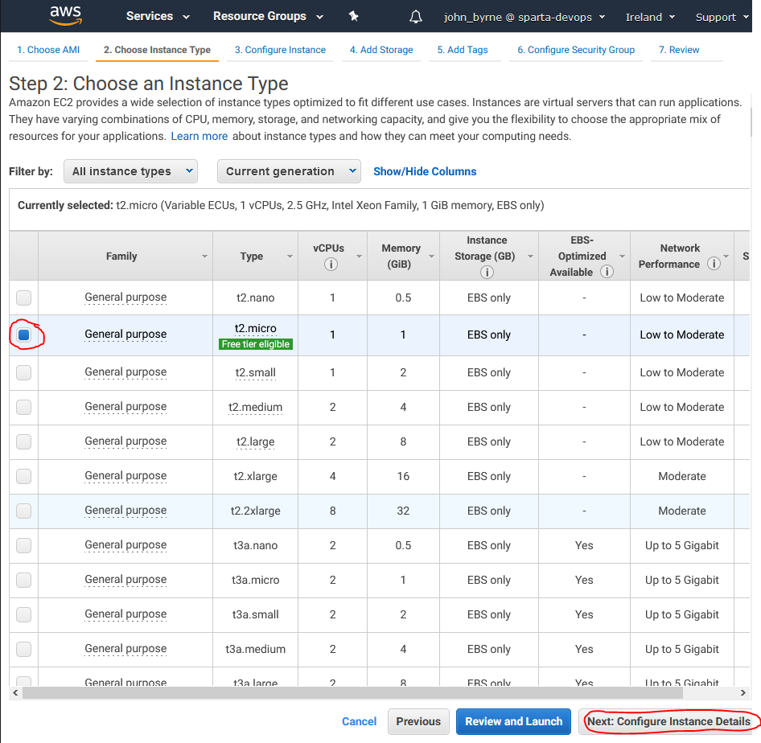
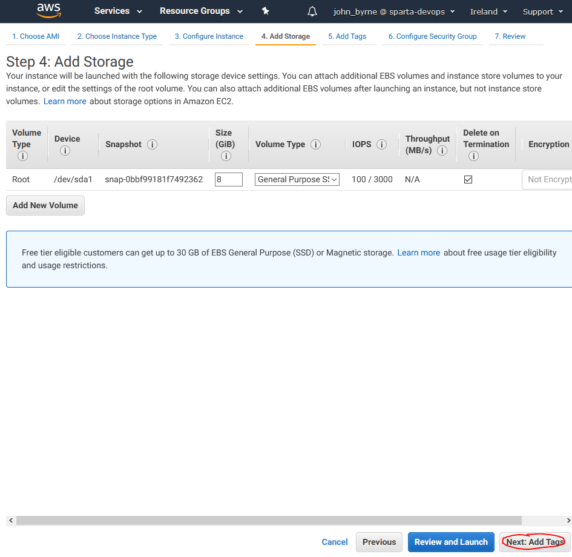
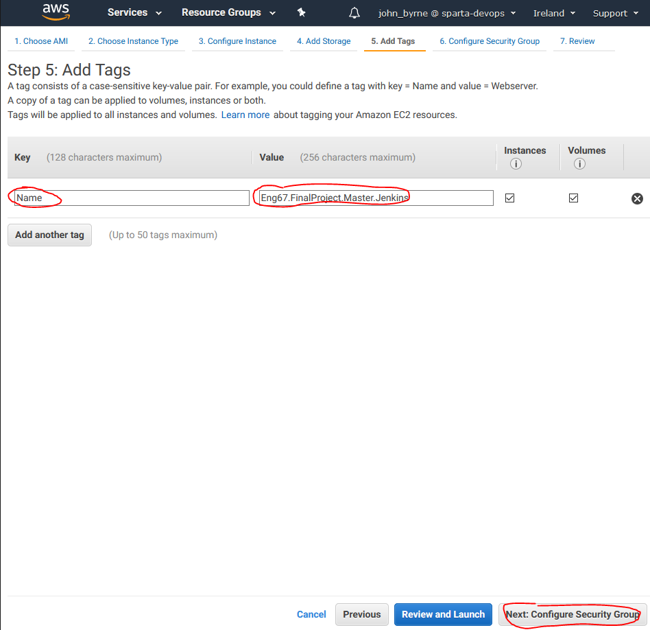
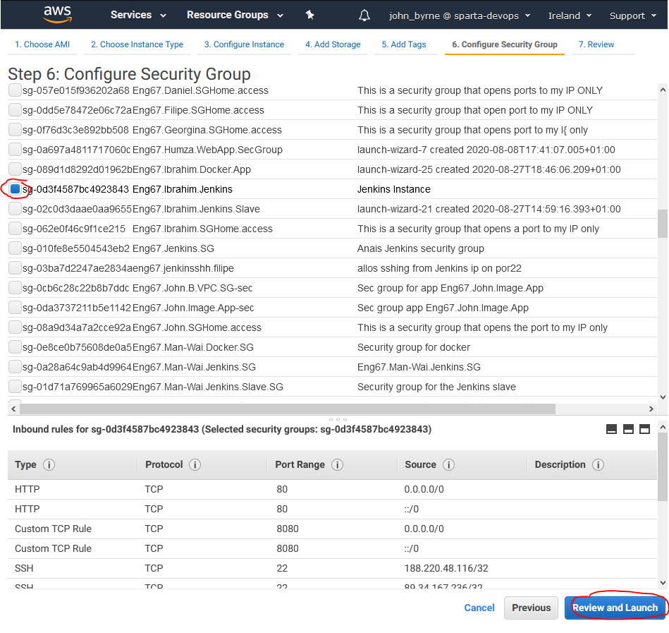
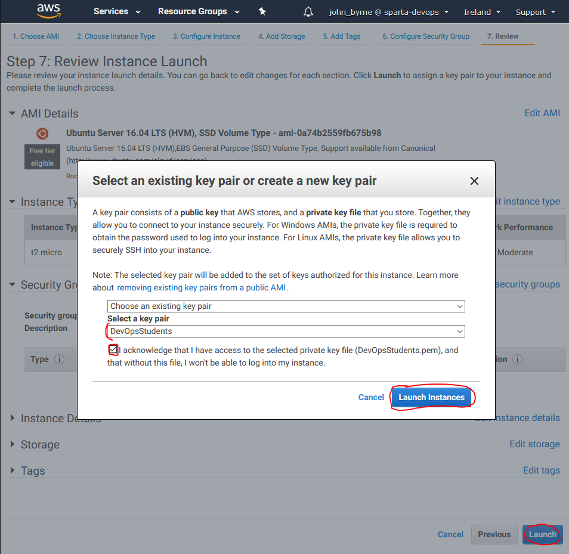
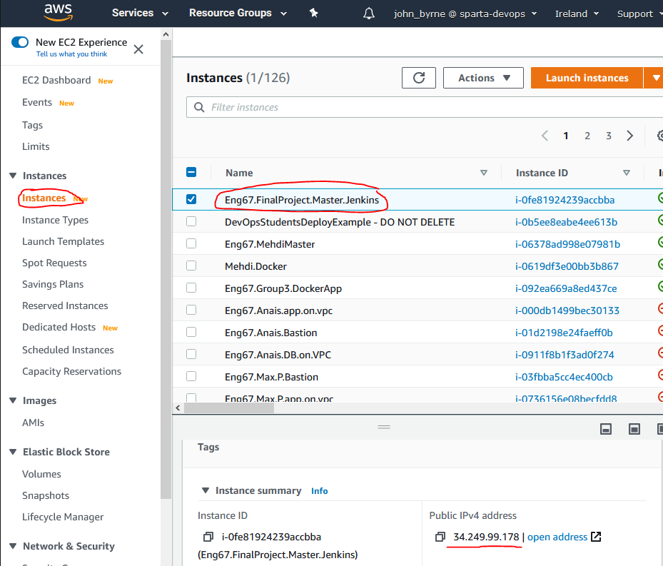
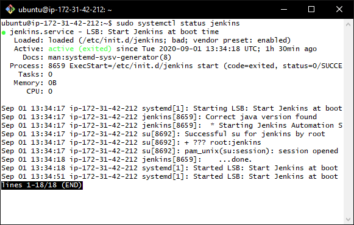
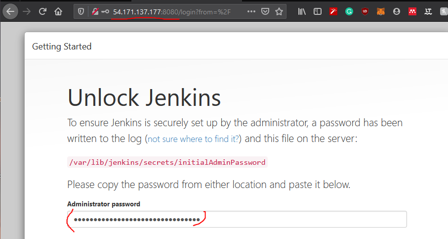

# CI / CD Pipeline using Jenkins

We are going to be creating the Continuous Integration and Delivery steps within our End to End pipeline using the automation tool **Jenkins**.

To host this we are going to be making use of **AWS**, A.K.A **Amazon Web Services**. They are going to provide us with Virtual Machines known as **EC2** instances hosted on their cloud service.

<details>
<summary>More Information (Cick Here)</summary>
<p>

### Further Information on Key Words

1. _**What is Jenkins?**_ - Jenkins is an automation server commonly used to support building, deploying and automating any project pipeline. It is open source, meaning there are thousands of amazing plugins.
2. _**What is AWS**_ - Amazon Web Services is an on-demand cloud platform that provides services to companies requiring database storage, content delivery, or other functionality.
3. _**What is a EC2**_ - A Service on AWS it stands for _Amazon Elastic Compute Cloud_ is a web service that provides secure, resizable compute capacity in the cloud. Designed to make web-scaling easier and allows access to VMs on Amazons computing environment.
4. _**VPC**_ - A Virtual private cloud on AWS creates a virtual network to launch resources into; such as a EC2. This virtual network closely resembles a traditional network that you'd operate in your own data center, with the benefits of using the scalable infrastructure of AWS. 

</p>
</details>

Below is the steps we took to set up this part of the Pipeline.

### Step 1. Setting up our Jenkins Instance

<details>
<summary>Text Instructions (Cick Here)</summary>
<p>

Go to Amazon Web Services Console and navigate to the EC2 Service, from there select **Create Service**.

Then Choose the **Ubuntu 16.04 LTS (HVM)** on **64-bit(x86)**.


Now Choose the **t2.micro** type, this is big enough as we are only running small jobs on our server.



Configure the instance so it is attached to a VPC, Subnet and Auto-assign public IP. Make sure you attach it to your own VPC if you have one.


For storage, leave it as it is as this is enough for our server. If it was bigger 8GB may not be enough.



Now give the Instance a memorable and meaningful name as this is what it will appear as in the instances dropdown.



For the Security Group, you need to create a set of necessary inbound and outbound rules. These will allow access into our server with specific access rights. I already had a pre-made security group so I used that but you can go ahead and create your own.

The Security group rules should look like so:

**Inbound Rules**

| **Type**   | **Protocol** | **Port range** | **Source**      | **Description**                  |
|------------|--------------|----------------|-----------------|----------------------------------|
| HTTP       | TCP          | 80             | 0.0.0.0/0       | HTTP Access                      |
| HTTP       | TCP          | 80             | ::/0            | HTTP Access                      |
| Custom TCP | TCP          | 8080           | 0.0.0.0/0       | Jenkins Default Port             |
| Custom TCP | TCP          | 8080           | ::/0            | Jenkins Default Port             |
| SSH        | TCP          | 22             | <your_ipv4>/32  | SSH From your IP                 |
| SSH        | TCP          | 22             | <slave_ipv4>/32 | SSH From Slave Node              |
| SMTP        | TCP          | 25             | 0.0.0.0/0 | Allow Emails to be sent on SMTP Port               |
| SMTP        | TCP          | 25             | ::/0 | Allow Emails to be sent on SMTP Port              |
| Custom TCP | TCP          | 3000           | 0.0.0.0/0       | NodeJS default Port              |
| Custom TCP | TCP          | 3000           | ::/0            | NodeJS default Port              |
| HTTPS      | TCP          | 443            | 0.0.0.0/0       | HTTPS Access                     |
| HTTPS      | TCP          | 443            | ::/0            | HTTPS Access                     |
| Custom TCP | TCP          | 9007           | 0.0.0.0/0       | Allow Slave access  on this Port |
| Custom TCP | TCP          | 9007           | ::/0            | Allow Slave access on this Port  |

**Outbound Rules**

| **Type**    | **Protocol** | **Port range** | **Source** | **Description**       |
|-------------|--------------|----------------|------------|-----------------------|
| All traffic | All          | All            | 0.0.0.0/0  | Allow All Traffic Out |

_This is me selecting an existing Security Group_.



Now launch the instance, and choose a key that will be used to SSH into the instance later on to set it up. In this case I chose the DevOpsStudentKey



Now we should be able to view our instance in the main menu, we can also get the IP if we click it and copy the public IPv4 address. Copy this address for now as we will need it in the next step.



Now go into a unix-based terminal on your system, in my case the GitBash Terminal. and write the following command. Make sure you have the corresponding key you set in the `.ssh` folder.

```bash
# SSH into the Jenkins instance using SSH
ssh -i ~/.ssh/DevOpsStudentKey ubuntu@<ipv4_of_EM2>
```

Once you are inside we need to install Jenkins and start it on our instance. Instance is by default running on port `8080`.

```bash
# Install Java Development Kit (JDK)
sudo apt update -y
sudo apt install openjdk-8-jdk

# Install Jenkins
wget -q -O - https://pkg.jenkins.io/debian/jenkins-ci.org.key | sudo apt-key add -

echo "deb https://pkg.jenkins.io/debian-stable binary/" | sudo tee /etc/apt/sources.list.d/jenkins.list

# Update Machine
sudo apt-get update -y
sudo apt-get install jenkins
sudo systemctl start jenkins
sudo systemctl status jenkins
```

This should then display a success message like the one below, if the server has been successfully installed.



Lastly, we need to add a docker socket into our Jenkins server. this is to ensure it will be compatiable with docker.

These are the following commands to create a user called docker with access to a socket, allowing connection out and in.

```bash
# Add a new user docker to the sudo group
sudo groupadd docker
sudo usermod -aG docker ${USER}
su -s ${USER}
sudo systemctl restart docker
sudo chmod 666 /var/run/docker.sock
```

We are going to set up the Jenkins Server in our browser in the next step...

</p>
</details>

<details>
<summary>Video Instructions (Click Here)</summary>
<p>

**This is a Gif of the Steps to take**, it less descriptive than the text but is here for extra help of what steps you need to take.

### Video 1 - Setting up Jenkins EC2 on AWS


### Video 2 - Setting up Jenkins Automation Server


commands run in this video 
```bash
sudo apt update -y
sudo apt install openjdk-8-jdk
wget -q -O - https://pkg.jenkins.io/debian/jenkins-ci.org.key | sudo apt-key add -
echo "deb https://pkg.jenkins.io/debian-stable binary/" | sudo tee /etc/apt/sources.list.d/jenkins.list
sudo apt-get update -y
sudo apt-get install jenkins
sudo systemctl start jenkins
sudo systemctl status jenkins
```

</p>
</details>

### Step 2. Setting up Jenkins automation server

Go to your jenkins server on the web, with the IP and the correct port which is `8080`; the default port for Jenkins web server.

Before we do that lets fetch a secret passcode that Jenkins saves to activate the automation server. 

```bash
# get passcode
sudo cat /var/lib/jenkins/secrets/initialAdminPassword
```

It will be a random string, copy it and then navigate to the server in the browser with your IP like so: _192.312.131.12:8080_.



Now install the suggested plugins for Jenkins, wait until they are installed...


Now navigate to **Manage Jenkins > Plugin Manager** and install _Docker pipeline_ and _Docker_. As these will be needed later to work with Docker.

That is it for the Jenkins set up. Now we need a slave Node, so that it can run all of Jenkins workloads.

### Step 3. Setting up our Jenkins Slave Instance

Setting up Jenkins instance with a slave node, all the work that is sent to Jenkins is usually delegated to slave nodes which do whatever was requested and return a result.

Now we need another identical EC2 instance on AWS, this one can be called _Jenkins Slave_ or something similar. The set up is identical to the last one so refer back to the last step if you can't remember how.